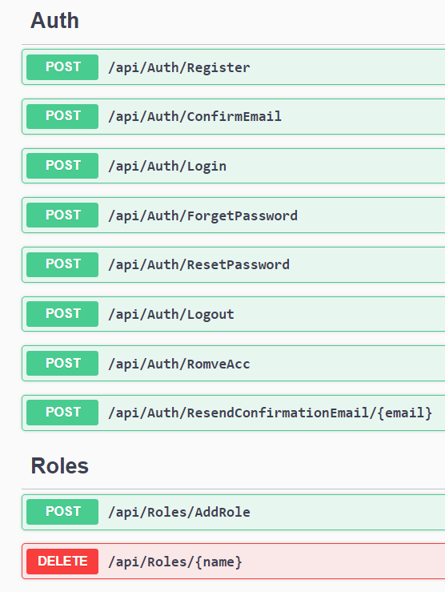

# AuthSystem
Authentication system using asp.net web api, and i using N-Tier Architecture to make the App scalabale and maintainable

## Installtion
feel free to download or clone the repo and edit in it

## How Use The App
#### *The App Has the follwoing endpoints in the Image*


1. ### Regsiter
   the *register* endpoint work to add new user in the system, and any user will registred from this endpoint will take 'User' role.
   you can edit the role of users from the application dashboard or using any method to change the role of the users.
   and also you can create and delete *Role* from the Roles controller
   ```
    {
      "fullName": "youssef shalaby",
      "email": "example@gmail.com",
      "userName": "y0ussef",
      "address": "menoufia",
      "password": "jo0123jo0@Y",
      "confirmPassword": "jo0123jo0@Y"
    }
   ```

2. ### Confirm Email
   once the user registered the user saved in the system database but the account not confirmed yet.
   the system send the OTP code to the Email of user, and the user will use this code to confirm email.
   the Confirm endpoint take the UserId(from Register endpoint response body) and the OTP code as the follwing example
   ```
    {
      "userId": "d84b854d-b06e-44e6-aab5-040cad0da7fd",
      "code": "8374"
    }
   ```

3. ### Logout
   once the account confirmed, the system logged in the user automatic by create login token and save it at the Browser cookie.
   and the cookie the expiration time of the token, so *logout* endpoint remove the token cookie from the browser.

5. ### Login
   once the account confirmed the user cann login to the system by the [email & password].
   login endpoint create token with some data of user and saved it in the Browser cookie, and when cookie expire the user will be no longer logged in.
   and there is another more thing, if the user tries to login 5 times and fail. the account will blocked for 5 min.
   

7. ### Forgot Password
   this endpoint used to make request to reset password, and take the 'email' of user to send activation link to re-direct the user to *Reset Password* endpoint.
   the resposne of this endpoint is [email & token], token here to expiration time for the activation link and more functionality

8. ### Reset Password
   this endpoint take the returned activation *token* from *Forgot password* endpoint and json object has email, new password and confirm new password
   ```
    {
      "email": "example@gmail.com",
      "newPassword": "jo0123jo0@YYAA",
      "confirmPassword": "jo0123jo0@YYAA"
    }
   ```

9. ### Remove Account
      this endoint used to remove the created account, and there are constraints to remove account like enter [email & correct password].
      once account removed cannot return it. you can add your logic to add period time before remove the account from the system
      ```
      {
        "email": "example@gmail.com",
        "password": "jo0123jo0@YYAA"
      }
      ```
10. ### Resend Email Confirmation code
    this endpoint will take from you the email of user, and then will resend the the confirmation OTP code in the email inbox.
    this endpoint generate another OTP code and new Activation token and update the created last one by new OTP code and token 

    ##### finally, you can add additional logic for the system to make it powerfull... happy code ❤️
      
   

   
   
